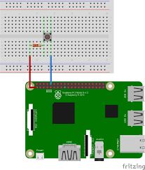
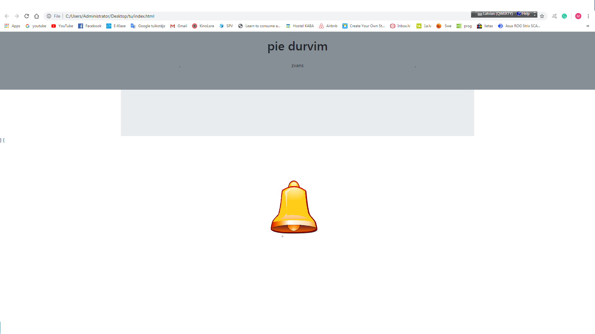

1.nedēļa 21.-28. aprilis.

plāns.
izveidot durvju zvanu kas būs savienot ar raspberry pi un nodods ienākošās ziņas tālāk uz web saitu kur tu varēsi to redzēt jebkurā vietā kur tu būtu.

Darba plāns.

izveidot kodu python durvju zvanam.

izveidot web saiti.

izveidot prototipu durvju zvanam un savienot ar raspberry.

savienot visus kopā lai strādātu un funkcionetu secīgi.

pa šīm brīvdienām esmu izveidojis kodu durvju zvanam :

import RPi.GPIO as GPIO

from time import sleep

GPIO.setmode(GPIO.BCM)

GPIO.setup(18, GPIO.IN, pull_up_down=GPIO.PUD_UP)

while True:

input_state = GPIO.input(18)

if input_state == False:

print ("The button works!")

sleep(0.1)

2.nedela 1-15 maijam

komanda:Mtiss 
komandas nosaukums-zvans
saja projekta velos izveidot zvanu ar raspberry palidzibu kas spetu dot majas ipasniekam zinu , kad pie durvim kads zvana
un velas tikt ieksa. si doma man piesaistija jo uzskatu ka tas ir vajadzigs katrai majai. tas palidzetu cilvekiem kuri iezi celo ,strada darza vie citas iestades un vienkarsi kurliem cilvekiem.
mans plans: izveidot durvu zvanu kas nosutitu zinu uz telefona aplikaciju.

si nedelas plans bija izjaukt majas durvju zvanu un savienot ar raspberry. izveidot majaslapu kurai pinas signasl.

sis plans neizdwvas jo netikai es sabojaju savas majas zvana korpusu ,bet ari pasu zvanu(laikam salaidu kaut ko uz iso.

si ir mana izveiiiidotamajas lapa uz kuru tiktu nosutits pazinojums par zvana lietosanu.

lidz galam neizdevas sakartot raspberry pikodu un velmes pabeigt so darbu nakotne netiek atmestas. kad bus velme un laiks tadnoteikt to paveiksu jo sada ierice ir loti noderiga.
man ir labak jaapgust pitona koda rakstisana un kartigi jaizprot si programesanas valoda.galu gala man pasam sev ir japlano savs laiks skolai un uzdotajiem darbiem. ja es butu sacis laicigak stradat piesi projekta tad butu ticis audz talak.
Matiss Murans.
